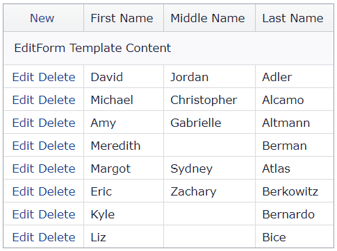

<!-- default badges list -->

[](https://supportcenter.devexpress.com/ticket/details/T223758)
[](https://docs.devexpress.com/GeneralInformation/403183)
[](#does-this-example-address-your-development-requirementsobjectives)
<!-- default badges end -->
# Grid View for ASP.NET MVC - How to create a custom edit form for new rows

This example demonstrates how to specify the grid's edit form template for newly inserted rows.



## Overview

Handle the grid's client-side [BeginCallback](https://docs.devexpress.com/AspNetMvc/js-MVCxClientGridView.PerformCallback(data)) event to determine the grid's edit mode after a callback.

```js
function OnBeginCallback(s, e) {
    var isNewRowNow = s.IsNewRowEditing();
    var isSwitchToNewRow = (e.command == 'ADDNEWROW');
    var IsCancelEdit = (e.command == 'CANCELEDIT');
    var IsSwitchToEdit = (e.command == 'STARTEDIT');
    var result = (isSwitchToNewRow * !IsCancelEdit + isNewRowNow) * !IsSwitchToEdit;
    e.customArgs['IsNewRow'] = Boolean(result);
}
```

Process the received value in the Controller and use the ViewBag mechanism to pass the value to the View.

```cs
[HttpPost, ValidateInput(false)]
public ActionResult GridViewEditingPartial(bool IsNewRow) {
    if (IsNewRow)
        ViewBag.IsNewRow = true;
    return PartialView(list.GetPersons());
}

[HttpPost, ValidateInput(false)]
public ActionResult EditingAddNew([ModelBinder(typeof(DevExpressEditorsBinder))] Person person) {
    ViewBag.IsNewRow = true;
    // ...
}
```

Call the grid's [SetEditFormTemplateContent](https://docs.devexpress.com/AspNetMvc/DevExpress.Web.Mvc.MVCxGridViewProperties.SetEditFormTemplateContent.overloads) method to create an edit form template based on the ViewBag value.

```cshtml
if(ViewBag.IsNewRow != null)
    if(ViewBag.IsNewRow == true)
        settings.SetEditFormTemplateContent(c => {
            ViewContext.Writer.Write("EditForm Template Content");
        });
```

## Files to Review

* [HomeController.cs](./CS/Sample/Controllers/HomeController.cs) (VB: [HomeController.vb](./VB/Sample/Controllers/HomeController.vb))
* [GridViewEditingPartial.cshtml](./CS/Sample/Views/Home/GridViewEditingPartial.cshtml)
* [Index.cshtml](./CS/Sample/Views/Home/Index.cshtml)

## Documentation

* [Templates](https://docs.devexpress.com/AspNetMvc/14721/common-features/templates)
<!-- feedback -->
## Does this example address your development requirements/objectives?

[](https://www.devexpress.com/support/examples/survey.xml?utm_source=github&utm_campaign=asp-net-mvc-grid-edit-form-template-for-new-rows&~~~was_helpful=yes) [](https://www.devexpress.com/support/examples/survey.xml?utm_source=github&utm_campaign=asp-net-mvc-grid-edit-form-template-for-new-rows&~~~was_helpful=no)

(you will be redirected to DevExpress.com to submit your response)
<!-- feedback end -->
